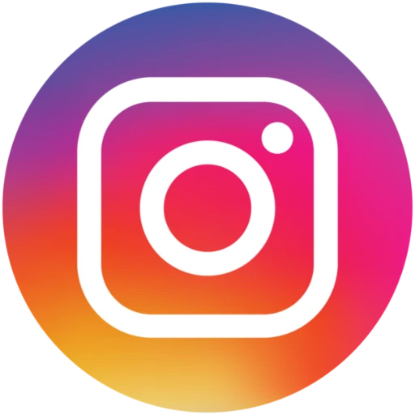

  

<!--  -->

## Social Handles

  <!-- LinkedIn -->
  
  <!-- Gmail -->
  
  <!-- YouTube -->
  
  <!-- FaceBook -->
  
  <!-- Twitter -->
  
  <!-- Instagram -->
  

## Different Wings of GFG TMSL
  - **Technical** Wing
  - **Events** Wing
  - **Design & Branding** Wing
  - **Public Relations & Outreach** Wing
  - **Marketing & Sponsership** Wing
  - **Social Media** Wing

## Our Current Core Team
  - **Chairperson**: [Arin Karmakar](https://wa.me/919476476209)
  - **Vice-Chairperson**: [Chandan Kumar Raj](https://wa.me/918340606284)
  - **Technical Wing** *Head*: 
  - **Technical Wing** *Co-Head*: 
  - **Events Wing** *Head*: 
  - **Events Wing** *Co-Head*: 
  - **Design & Branding Wing** *Head*: 
  - **Design & Branding Wing** *Co-Head*: 
  - **Public Relations & Outreach Wing** *Head*: 
  - **Public Relations & Outreach Wing** *Co-Head*: 
  - **Marketing & Sponsership Wing** *Head*: 
  - **Marketing & Sponsership Wing** *Co-Head*: 
  - **Social Media Wing** *Head*: 
  - **Social Media Wing** *Co-Head*: 

## Our Objectives
- **Skill Enhancement**: 
  - Conduct coding competitions, 
  - Conduct workshops and webinars focused on:
    - Data structures and different algorithms
    - Different software development tools
    - Cutting edge technologies
- **Industry Exposure**:
  - We provide guidance with access to guest lectures and mentorship from industry professionals.
  - We help others to gain insights into current trends and technologies.
- **Project Development**: 
  - We encourage students to 
    - work on real-world projects.
    - contribute to open-source projects.
    - build their portfolio.
    - participate in different types of hackathons.
- **Community Building**: 
  - We create a platform where students can collaborate, solve problems, and support each other in their technical journeys.

<!-- ## Our Vision
- KICHU NEI -->

## Important Links
<!-- - Visit our website at [https://gfgtmsl.com](https://gfgtmsl.com) -->
- To join our WhatsApp community [click here](https://chat.whatsapp.com/CCJpcqGNEpDDwFxQJcogka).
